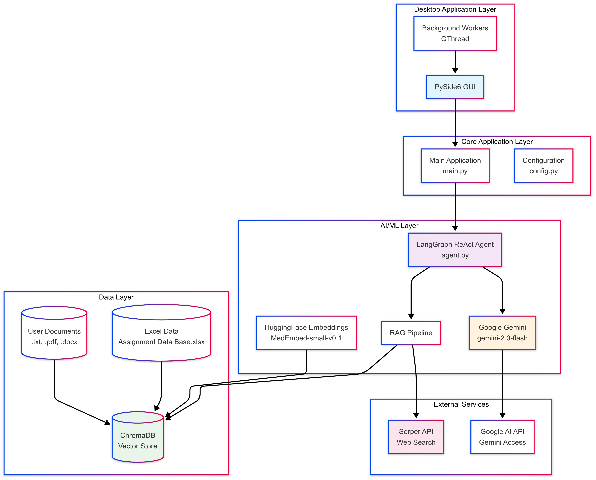

# Medical First-Aid AI Assistant

This project is a desktop application that acts as a patient-safety-focused Medical First-Aid Assistant. It uses a Retrieval-Augmented Generation (RAG) pipeline, combining a local vector database, real-time web search, and a large language model (Google's Gemini) to provide structured, safety-conscious first-aid guidance.

## High-Level Architecture


## Data Flow Diagram


## Table of Contents

-   [Features](#features)
-   [Setup and Installation](#setup-and-installation)
-   [Usage](#usage)
-   [Project Structure](#project-structure)
-   [Design and Trade-offs](#design-and-trade-offs)
-   [Testing](#testing)

## Features

-   **Hybrid RAG Pipeline**: Augments LLM prompts with context from both a local ChromaDB vector store and real-time Google search results for comprehensive answers.
-   **Structured and Safe Output**: Employs a strict system prompt to force the LLM into providing responses in a mandatory template (Triage, Condition, Steps, Medicine, Citations).
-   **Safety-First Triage**: The system is designed to prioritize emergency escalation for severe symptoms.
-   **GUI Interface**: A user-friendly and responsive desktop application built with PySide6 and the `qt_material` theme.
-   **Dynamic Knowledge Base**: Users can add new documents (`.txt`, `.pdf`, etc.) to the local knowledge base directly from the UI, which are then processed and embedded for future queries.
-   **Asynchronous Operations**: Heavy tasks like agent initialization and document ingestion are run in background threads to keep the UI responsive.

---

## Setup and Installation

### 1. Prerequisites

-   Python 3.9+
-   `libmagic` (a dependency for document processing)
    -   **Windows**: The necessary binaries are often included with `python-magic-bin`.
    -   **macOS**: `brew install libmagic`
    -   **Linux (Debian/Ubuntu)**: `sudo apt-get install libmagic1`

### 2. Clone the Repository

```bash
git clone https://github.com/Rithvik119am/medical_ai_assistant.git
cd medical_ai_assistant
```

### 3. Create a Virtual Environment

Using a virtual environment is strongly recommended to manage dependencies.

```bash
# Windows
python -m venv venv
.\venv\Scripts\activate

# macOS / Linux
python3 -m venv venv
source venv/bin/activate
```

### 4. Install Dependencies

Install all required Python packages from the `requirements.txt` file.

The following command will work without `uv`, but installing the packages may take significantly longer. Using `uv` is recommended for faster installation.
```bash
uv pip install -r requirements.txt
```


### 5. Obtain API Keys

The application requires API keys for two services:
1.  **Google AI API Key**: For accessing the Gemini LLM. Get one from [Google AI Studio](https://aistudio.google.com/app/apikey).
2.  **Serper API Key**: For the real-time web search tool. Get a free key from [Serper.dev](https://serper.dev/).

You can either enter these keys directly into the GUI or set them as environment variables for convenience:

```bash
# Windows (Command Prompt)
set GOOGLE_API_KEY="your_google_api_key"
set SERPER_API_KEY="your_serper_api_key"

# macOS / Linux (Terminal)
export GOOGLE_API_KEY="your_google_api_key"
export SERPER_API_KEY="your_serper_api_key"
```
or you can create a `.env` file in the root directory of the project and add the following lines:

```bash
GOOGLE_API_KEY="your_google_api_key"
SERPER_API_KEY="your_serper_api_key"
```

### 6. Place Your Initial Data File

Place your Excel data file, named `Assignment Data Base.xlsx`, in the root directory of the project. This file must contain a column named **`Sentence`**, which will be used for the initial knowledge base population.

---

## Usage

### 1. Initial Data Ingestion (One-Time Step)

Before the first run, you must populate the local vector database. Run the ingestion script from the project's root directory:

```bash
python -m src.medical_assistant.data_ingestion
```

This command reads your `.xlsx` file, generates embeddings for each sentence, and saves them in a `medical_chroma_db` folder. You only need to run this once or whenever your source Excel file is updated.

### 2. Launch the Application

To start the GUI, run the main script from the root directory:

```bash
python -m src.medical_assistant.main
```

### 3. Using the AI Assistant

1.  **Initialize the Agent**: If you haven't set environment variables, enter your Google and Serper API keys into the fields on the left. Click **"Initialize Agent"**. The status label will update when the system is ready.
2.  **Ask a Question**: Once the agent is ready, type a medical first-aid question into the input box at the bottom and press `Enter`.
3.  **Add New Knowledge**: Click **"Add Document to Knowledge Base"** to open a file dialog. Select a document (`.pdf`, `.txt`, `.docx`) to add its content to the vector store for future queries. The UI will remain responsive while the document is processed in the background.
4.  **Clear Chat**: Click **"Clear Chat"** to reset the conversation history.

---

## Project Structure

The project follows a standard `src` layout to separate the application source code from other files like tests and documentation.

```
/
├── medical_chroma_db/    # Generated local vector database
├── src/
│   └── medical_assistant/  # Main application package
│       ├── __init__.py
│       ├── agent.py        # Agent creation and RAG logic
│       ├── config.py       # All configuration and prompts
│       ├── data_ingestion.py # Script for initial data loading
│       ├── main.py         # Main application entry point (GUI)
│       ├── ui.py           # PySide6 UI components
│       └── workers.py      # QThread workers for background tasks
├── tests/
│   ├── ...               # Unit tests for core logic
├── .gitignore
├── Assignment Data Base.xlsx # Initial data source
├── README.md
├── requirements.txt
└── run_tests.py          # Helper script to run all tests
```

---

## Design and Trade-offs

This section discusses the key architectural decisions and their implications.

### 1. Hybrid RAG vs. Single-Source RAG

-   **Decision**: The application uses a hybrid RAG approach, pulling context from both a local `ChromaDB` vector store and a real-time `google-serper` web search.
-   **Trade-off**:
    -   **Pro**: This provides the best of both worlds. The local DB ensures that specific, curated information (from `Assignment Data Base.xlsx`) is always available and prioritized. The web search allows the agent to answer questions about topics not present in the local data, making it far more versatile and up-to-date.
    -   **Con**: This approach increases complexity and latency. Each query involves a local similarity search *and* an external API call, making the response time slightly longer than a single-source RAG. It also introduces an additional external dependency (Serper API).

### 2. Desktop Application (PySide6) vs. Web Application (Flask/FastAPI)

-   **Decision**: The interface is a native desktop GUI built with PySide6.
-   **Trade-off**:
    -   **Pro**: A desktop app is ideal for handling local resources like ChromaDB without exposing them over a network. It provides a stable, self-contained environment for the user and simplifies the deployment for single-user scenarios. It also avoids the complexities of web hosting, security (CORS, etc.), and state management in a browser.
    -   **Con**: The application is not easily shareable or accessible from multiple devices like a web app would be. Distribution requires packaging the application for different operating systems (e.g., using PyInstaller), which can be more complex than deploying a web server.

### 3. LangGraph ReAct Agent vs. Simple LCEL Chain

-   **Decision**: A `create_react_agent` from LangGraph was used to orchestrate the LLM and its tools.
-   **Trade-off**:
    -   **Pro**: The ReAct (Reasoning and Acting) framework is highly robust. It allows the LLM to "think" step-by-step, decide which tool to use (e.g., `google-serper`), use it, observe the result, and then repeat the process until it can form a final answer. This is crucial for a medical assistant that must find and cite sources accurately. It makes the agent more reliable and less prone to hallucination.
    -   **Con**: A ReAct agent is slower and more token-intensive than a simple LangChain Expression Language (LCEL) chain. The agent's "thought process" involves multiple back-and-forth calls to the LLM, increasing latency and cost compared to a single-pass `context -> prompt -> LLM` chain.
### 4. Layered RAG: Pre-fetching Context and Agent Tool Access

-   **Decision**: The application employs a two-stage Retrieval-Augmented Generation (RAG) strategy. Before the user's query is sent to the LLM agent, an initial context is pre-fetched via a local vector database search (`ChromaDB`) and a direct `google-serper` web search. This combined context is then injected into the prompt alongside the user's original query. **Crucially**, the LangGraph ReAct agent also retains its inherent capability to execute its own `google-serper` tool calls if it determines more information is needed or if the pre-fetched context is insufficient.

-   **Trade-off**:
    -   **Pro**:
        -   **Guaranteed Initial Relevance**: The pre-fetching step ensures that the LLM always receives an initial, directly relevant context from both the internal knowledge base and a fresh web search, anchoring its initial response and reducing the chance of immediate hallucination.
        -   **Robustness & Adaptability**: The agent's ability to perform *additional* searches provides a fallback mechanism. If the pre-fetched context doesn't fully cover the query, the agent can dynamically seek more specific information, leading to more comprehensive and accurate answers for complex or nuanced questions.
        -   **Potential Efficiency for Simple Queries**: For queries where the pre-fetched context is perfectly adequate, the agent might not need to invoke its own search tool, potentially leading to faster responses in those cases.
    -   **Con**:
        -   **Redundancy and Cost**: There's a potential for redundant web searches. The initial pre-fetching might retrieve information that the agent then re-searches using its own tool, leading to increased API costs (for Serper) and unnecessary latency.
        -   **Increased Token Usage**: Injecting a potentially large volume of pre-fetched context into the initial prompt consumes more input tokens, which can increase the cost per query for the LLM.
        -   **Complexity**: Managing this layered approach adds complexity to the RAG pipeline compared to simply relying solely on the agent's internal tool-use capabilities. The LLM must intelligently integrate both pre-fetched and self-retrieved information.
### 5. Background Workers (QThread) for Heavy Tasks

-   **Decision**: Long-running operations (agent initialization, document ingestion) are offloaded to background `QThread` workers.
-   **Trade-off**:
    -   **Pro**: This is essential for a good user experience. It prevents the GUI from freezing while waiting for network calls or model loading, keeping the application responsive. It uses signals and slots for clean, thread-safe communication between the worker and the main UI thread.
    -   **Con**: Multi-threading introduces complexity. Care must be taken to ensure thread safety, properly manage worker lifecycles, and handle potential race conditions (though PySide6's signal/slot mechanism mitigates this significantly). It makes the code slightly harder to debug than a purely synchronous application.

---

## Testing

The project includes a suite of unit tests to ensure the core logic is reliable and to facilitate future development.

To run the tests, execute the test runner script from the project's root directory:

```bash
python run_tests.py
```

The tests use the `unittest.mock` library extensively to isolate components and test them without making real network calls or loading large models. This ensures the tests are fast, deterministic, and can run offline.