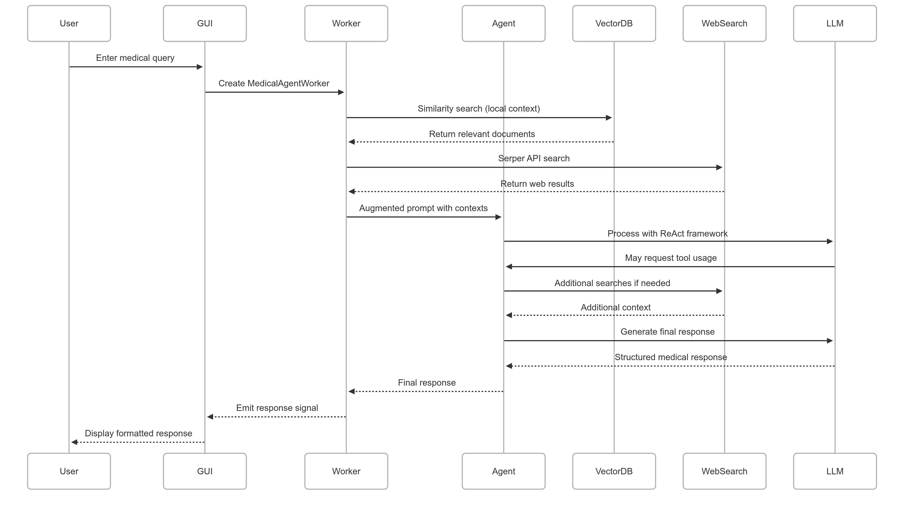
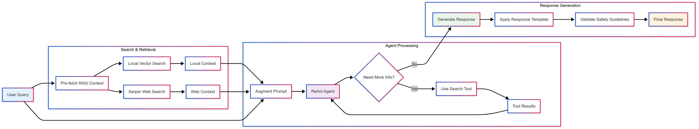

# Architecture Documentation

## Medical First-Aid AI Assistant Architecture

This document outlines the system architecture, component interactions, and data flow of the Medical First-Aid AI Assistant application.

## System Overview

The Medical First-Aid AI Assistant is a desktop application that provides safety-conscious medical first-aid guidance using a hybrid Retrieval-Augmented Generation (RAG) approach. The system combines local knowledge storage, real-time web search, and large language model capabilities to deliver structured, evidence-based responses.

## High-Level Architecture

## Component Architecture

### 1. User Interface Layer

**PySide6 GUI (`ui.py`)**
- **Purpose**: Provides the desktop interface for user interaction
- **Key Features**:
  - Chat interface with message history
  - API key configuration
  - Document upload functionality
  - Real-time status updates
- **Threading**: Uses QThread workers for non-blocking operations

### 2. Application Core

**Main Application (`main.py`)**
- **Purpose**: Application entry point and initialization
- **Responsibilities**:
  - GUI setup and theming
  - Environment configuration
  - Application lifecycle management

**Configuration (`config.py`)**
- **Purpose**: Centralized configuration management
- **Contains**:
  - Model specifications
  - System prompts
  - File paths
  - Response templates

### 3. AI/ML Processing Layer

**LangGraph ReAct Agent (`agent.py`)**
- **Purpose**: Orchestrates the reasoning and action loop
- **Capabilities**:
  - Tool usage (web search)
  - Multi-step reasoning
  - Context integration
  - Response generation

**RAG Pipeline**
- **Hybrid Approach**: Combines local and web-based retrieval
- **Components**:
  - Local vector similarity search
  - Real-time web search
  - Context augmentation
  - Prompt engineering

### 4. Data Management

**ChromaDB Vector Store**
- **Purpose**: Local knowledge base storage
- **Features**:
  - Semantic similarity search
  - Persistent storage
  - Incremental updates
  - Duplicate detection

**Document Processing**
- **Supported Formats**: .txt, .pdf, .docx, .md
- **Processing**: Uses `unstructured` library for document parsing
- **Embedding**: HuggingFace MedEmbed model for medical domain

### 5. Background Processing

**QThread Workers (`workers.py`)**
- **AgentInitializationWorker**: Handles agent setup
- **ChromaDBIngestionWorker**: Processes document uploads
- **MedicalAgentWorker**: Handles query processing

## Data Flow Diagram

## Query Processing Architecture

## System Initialization Flow

## Security and Safety Architecture

### Safety Mechanisms

1. **Triage Priority System**
   - Emergency detection patterns
   - Mandatory escalation protocols
   - Severity assessment logic

2. **Response Validation**
   - Template enforcement
   - Citation requirements
   - Medical disclaimer inclusion

3. **Content Filtering**
   - Prescription medication restrictions
   - Diagnostic limitation enforcement
   - Source verification requirements

### Security Measures

1. **API Key Management**
   - Environment variable support
   - Secure input fields (password mode)
   - Local storage prevention

2. **Data Isolation**
   - Local vector database
   - No external data persistence
   - Thread-safe operations

## Performance Considerations

### Optimization Strategies

1. **Asynchronous Operations**
   - Background threading for heavy tasks
   - Non-blocking UI updates
   - Responsive user experience

2. **Caching Mechanisms**
   - Model caching for embeddings
   - Vector store persistence
   - Duplicate detection

3. **Resource Management**
   - Memory-efficient document processing
   - Incremental vector updates
   - Connection pooling

### Scalability Factors

1. **Vector Database Growth**
   - Efficient similarity search
   - Incremental indexing
   - Storage optimization

2. **Concurrent Operations**
   - Thread pool management
   - Queue-based processing
   - Resource limiting

## Deployment Architecture

### Local Deployment

### Distribution Considerations

1. **Packaging Options**
   - PyInstaller for executable creation
   - Virtual environment isolation
   - Dependency bundling

2. **Platform Support**
   - Windows, macOS, Linux compatibility
   - Architecture-specific builds
   - Runtime dependency management

## Technology Stack Summary

| Layer | Technology | Purpose |
|-------|------------|---------|
| **UI Framework** | PySide6 | Desktop GUI |
| **Theme** | qt_material | Modern UI styling |
| **AI Framework** | LangChain/LangGraph | Agent orchestration |
| **LLM** | Google Gemini 2.0 Flash | Response generation |
| **Embeddings** | HuggingFace MedEmbed | Medical domain embeddings |
| **Vector DB** | ChromaDB | Local knowledge storage |
| **Web Search** | Serper API | Real-time information |
| **Document Processing** | Unstructured | Multi-format parsing |
| **Threading** | QThread | Background processing |
| **Configuration** | python-dotenv | Environment management |
